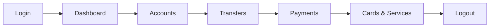

<h1 align="center">
  RFHL UAT AQA
  <br>

    
</h1>
<p align="center">
  <em>End-to-end test automation for the <b>RFHL UAT</b> banking dashboard.<br/>Validates user journeys from authentication through financial operations.</em>
</p>

---

## Overview

Black-box test automation against the live UAT environment. Tests are **user-journey driven** and **route-focused**-validating what users experience, not implementation details.

| Status | Feature |
|:------:|---------|
| ✓ | Authentication & Access |
| ✓ | Home Dashboard |
| ◯ | Accounts |
| ◯ | Transfers |
| ◯ | Payments |
| ◯ | Cards |
| ◯ | Service Requests |

---

## AQA Scope

> [!NOTE]
> For detailed pass/fail criteria, see [AQA Criteria](docs/AQA-CRITERIA.md).



**What we validate:**
- Route access control and session integrity
- Page load, refresh, and navigation stability
- API-backed data accuracy (balances, transactions, timestamps)
- Transaction flows (transfers, payments) with success/failure handling
- Graceful degradation under slow networks and partial failures
- Cross-browser consistency (Chromium, Firefox, WebKit)

---

## Quick Start

See [Contributing Guide](docs/CONTRIBUTING.md) for full setup.

```bash
npm test          # Run all tests
npm test:ui       # Run with UI
npm test:report   # View report
```

---

## Sign-Off Gate

> [!IMPORTANT]
> UAT sign-off requires **0 test failures** across all browsers.

See the full [UAT Sign-Off Checklist](docs/AQA-CRITERIA.md#uat-sign-off-checklist).
