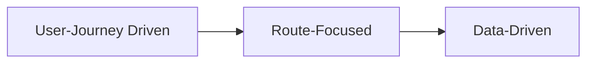

# AQA Criteria

> Detailed pass/fail criteria for RFHL UAT Application Quality Assurance.
>
> All testing is **black-box** and **user-journey focused** against the live UAT environment-no source code access is assumed.

---

## Quality Objectives

| Objective | What It Means |
|-----------|---------------|
| **Functional Correctness** | Features behave as specified across all supported browsers |
| **Session Integrity** | Auth state maintained correctly throughout the user journey |
| **Data Accuracy** | Balances, transactions, and user details resolve correctly from APIs |
| **Stability** | Pages load consistently without crashes, hangs, or layout breakage |
| **Graceful Degradation** | Slow networks and partial failures handled without data loss |

<br>

---

## Pass/Fail Criteria

> [!NOTE]
> **Pass** = expected user experience. **Fail** = broken, confusing, or insecure behavior.

### Route Access & Entry

| Condition | Pass | Fail |
|-----------|------|------|
| Unauthenticated → protected route | Redirected to login | Page renders or errors |
| Authenticated → protected route | Page loads with user context | Redirect loop, blank page, stale session |
| Browser back/forward | Correct route with expected state | Broken navigation, data mismatch, logout |
| Deep link with active session | Route loads directly | Forced redirect to home or login |

### Page Load & Stability

| Condition | Pass | Fail |
|-----------|------|------|
| Initial page load | Content renders within threshold | Blank screen, infinite spinner, partial render |
| Refresh on any route | Identical state after reload | Session loss, data inconsistency, error |
| Rapid navigation | Each route resolves correctly | Race conditions, stale data, UI flicker |
| Slow network (3G) | Content resolves; loading indicators shown | Timeout without feedback, corrupted layout |
| Extended use | Application remains stable | Memory leaks, degraded performance, logout |
| Multi-tab | Each tab maintains independent state | Cross-tab interference, session conflicts |

<br>

> [!TIP]
> **Banking Features** - Core transactional functionality that users rely on daily.

### Accounts

| Condition | Pass | Fail |
|-----------|------|------|
| Display all accounts | Each type appears (savings, chequing, credit, loan, utility, external) | Missing accounts, incorrect categorization |
| Balances and statuses | Values match expected test data | Incorrect balances, wrong currency, stale data |
| Timestamps and metadata | Correct and consistently formatted | Missing, malformed, timezone-incorrect |
| Account drill-down | Details load with correct context | Wrong account data, navigation failure |
| Multi-account user | All accounts accessible and distinguishable | Cross-contaminated or inaccessible |

### Transfers

> [!WARNING]
> Transfer failures can result in financial loss or duplicate transactions. Test thoroughly.

| Condition | Pass | Fail |
|-----------|------|------|
| Own accounts | Correct debit/credit with confirmation | Incorrect amounts, wrong accounts, silent failure |
| Local third-party | Routing validated; confirmation shown | Invalid routing accepted, valid rejected |
| International | Currency, fees, recipient handled correctly | Missing fields, incorrect conversion, submission failure |
| Validation errors | Clear messaging (insufficient funds, limits) | Ambiguous errors, form proceeds anyway |
| Post-transfer | Balances update; transaction in history | Stale balances, missing record |

### Payments

> [!WARNING]
> Payment errors can cause missed bills, late fees, or incorrect account states.

| Condition | Pass | Fail |
|-----------|------|------|
| Credit card payment | Correct amount; confirmation with reference | Wrong amount, missing reference, not applied |
| Loan payment | Correct allocation | Incorrect principal/interest split, failure |
| Utility payment | Biller resolved; amount accurate | Wrong biller, incorrect amount, submission error |
| Success messaging | Clear confirmation with details | Ambiguous or missing confirmation |
| Failure messaging | Clear error with guidance | Silent failure, misleading success |
| Post-payment | Balance and history updated | Stale data, missing transaction |

### Cards

> [!CAUTION]
> Card flows handle sensitive data. Security failures here are critical.

| Condition | Pass | Fail |
|-----------|------|------|
| VTM card request | Secure submission with clear feedback | Unclear state, missing confirmation, insecure |
| Cardless cash | Code generated with instructions and expiry | Missing code, unclear instructions, no expiry |
| State transitions | Each step indicated; back/cancel works | Stuck states, unclear progress, broken nav |
| Security | Sensitive data masked; secure transmission | Exposed credentials, codes, or PINs |

### Service Requests

| Condition | Pass | Fail |
|-----------|------|------|
| Submission | Confirmation with reference number | Silent failure, no reference |
| Tracking | Status visible and updates correctly | Status missing, stale, inconsistent |
| State changes | Reflected without refresh issues | Requires manual refresh, stale state |
| Navigation during flow | Session and form state preserved | Data loss on back/forward, session break |

<br>

> [!TIP]
> **Common Behaviors** - Patterns that apply across all features.

### Filters, Search, Sorting & Pagination

| Condition | Pass | Fail |
|-----------|------|------|
| Filters | Results update; state persists | Wrong results, lost on navigation, stale |
| Search | Relevant results; handles edge cases | Incorrect results, crashes, no feedback |
| Sorting | Order correct; persists across pages | Incorrect sort, resets unexpectedly |
| Pagination | Pages load; no duplicates or gaps | Data gaps, duplicates, infinite load |
| Combined | Filter + sort + paginate works together | State corruption, unexpected resets |

### Session Management

> [!CAUTION]
> Session vulnerabilities can expose user accounts to unauthorized access.

| Condition | Pass | Fail |
|-----------|------|------|
| Valid login + MFA | Session established, redirected to dashboard | Login fails, MFA loop, not persisted |
| Invalid credentials | Clear error, no session | Ambiguous error, partial session, crash |
| Logout | Session terminated, protected routes blocked | Session persists, stale tokens accepted |
| Timeout | Prompted to re-auth; no data loss | Silent logout, corrupted state |
| Refresh | State fully preserved | Partial loss, forced re-login |

### Error Handling & Resilience

| Condition | Pass | Fail |
|-----------|------|------|
| API 4xx/5xx | User-friendly message; no stack traces | Unhandled exception, blank screen, JSON dump |
| Network interruption | Graceful failure with retry/messaging | Data corruption, silent failure, hung UI |
| Partial API failure | Affected section errors; rest functional | Entire page breaks, misleading data |
| Slow network | Loading indicators; eventual resolution | Timeout without feedback, corrupted layout |
| Invalid route (404) | Custom error page or redirect | Browser default error, crash |

### Security & Data Protection

> [!CAUTION]
> Data exposure in a banking app is a critical security incident.

| Condition | Pass | Fail |
|-----------|------|------|
| Sensitive data | Masked by default; reveal option | Exposed account numbers/balances |
| Session tokens | Not in URL, logs, or errors | Tokens in browser history or output |
| User isolation | User sees only their own data | Data leakage from other accounts |

### Cross-Route Stability

| Condition | Pass | Fail |
|-----------|------|------|
| Full journey (login → actions → logout) | All steps succeed in sequence | Any step causes downstream failures |
| Repeated journeys | Consistent across iterations | Flaky failures, degraded performance |
| Rapid back/forward | State consistent; no crashes | Accumulated errors, memory issues, logout |
| Deep nav then home | Home state correct; no residual data | Stale or incorrect home state |

<br>

---

## Testing Philosophy



| Principle | Description |
|-----------|-------------|
| **User-Journey Driven** | Tests simulate real behavior: login, view accounts, transfer, pay, logout. A test passes when users complete their journey successfully. |
| **Route-Focused** | Each test validates a route's access control, content resolution, navigation integrity, and transaction completion. |
| **Multi-User & Data-Driven** | Same test logic validates different users. Edge cases covered by test data, not code. |

> [!NOTE]
> Adding a new user scenario? Just add test data-no code changes required.

```typescript
// Same test, different users - no code duplication
test.use({ userId: 'user1' }); // All account types
test.use({ userId: 'user2' }); // Chequing + savings only
test.use({ userId: 'user3' }); // International accounts
```

### Environment

| Aspect | Detail |
|--------|--------|
| Target | Live UAT (not mocked) |
| Network | Real latency; explicit waits |
| Browsers | Chromium, Firefox, WebKit |
| Source Access | None - observable behavior only |

<br>

---

## UAT Sign-Off Checklist

> [!IMPORTANT]
> **0 test failures** required for sign-off. Flaky tests must be investigated.

| Domain | Criteria |
|--------|----------|
| **Auth & Session** | Valid login + MFA succeeds · Invalid creds show errors · Logout terminates fully · Session persists on refresh |
| **Accounts** | All types display · Balances/currencies/timestamps accurate · Drill-down works |
| **Transfers** | Own-account works · Third-party validates · International handles currency · Errors are clear |
| **Payments** | All types process · Success/failure messaging clear · State updates correctly |
| **Cards & Services** | VTM/cardless cash secure · Service requests track correctly |
| **Stability** | Routes load correctly · Filters/search/sort/pagination work · Graceful degradation · Multi-tab works |
| **Cross-Browser** | Chromium · Firefox · WebKit · No critical a11y violations |

<br>

> [!CAUTION]
> **A single failing test blocks sign-off.** Intermittent failures often indicate real application instability-investigate before dismissing.
