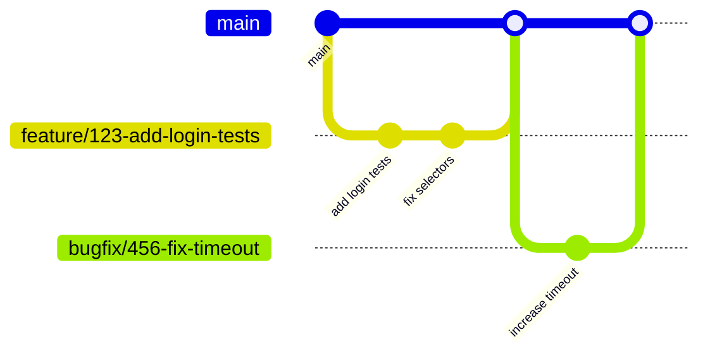
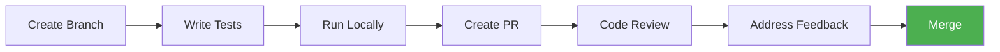

# Contributing

Guidelines for contributing to the RBL Trinidad UAT Test Automation project.

## Table of Contents

- [Getting Started](#getting-started)
- [Project Structure](#project-structure)
- [Development Workflow](#development-workflow)
- [Writing Tests](#writing-tests)
- [Running Tests](#running-tests)
- [Pull Request Process](#pull-request-process)

---

## Getting Started

### Prerequisites

| Software | Version | Installation |
|----------|---------|--------------|
| Node.js | v18+ | [nodejs.org](https://nodejs.org/) |
| npm | Latest | Included with Node.js |
| Git | Latest | [git-scm.com](https://git-scm.com/) |

### Setup

```bash
# Clone the repository
git clone https://github.com/rbl/rfhl-uat-aqa.git
cd rfhl-uat-aqa

# Install dependencies
npm install

# Install Playwright browsers
npx playwright install

# Configure test users
cp test-data/users.example.json test-data/users.local.json
# Edit users.local.json with your test credentials
```

> [!WARNING]
> Never commit `users.local.json` to the repository.

### Test User Credentials

Test users are defined in `test-data/users.local.json` (gitignored). This file is not committed to the repository.

1. Copy the example file: `cp test-data/users.example.json test-data/users.local.json`
2. Edit `users.local.json` with your actual credentials

### Environment Variables

| Variable | Description | Required |
|----------|-------------|----------|
| `BASE_URL` | The UAT environment URL | Yes |

Set the `BASE_URL` environment variable before running tests:

```bash
export BASE_URL=https://your-uat-url.com
```

---

## Project Structure

```
rfhl-uat-aqa/
├── e2e/                    # Test specs
├── test-data/
│   ├── fixtures.ts         # Playwright fixtures
│   ├── users.ts            # User types and loader
│   ├── users.example.json  # Template for credentials (committed)
│   └── users.local.json    # Your credentials (gitignored)
├── utils/                  # Helper functions
├── screenshots/            # Test screenshots
├── docs/                   # Documentation
├── playwright.config.ts    # Playwright configuration
└── package.json
```

---

## Development Workflow

### Branching Strategy



| Branch Type | Pattern | Example |
|-------------|---------|---------|
| Feature | `feature/{issue}/{description}` | `feature/123/add-login-tests` |
| Bug Fix | `bugfix/{issue}/{description}` | `bugfix/456/fix-timeout` |
| Hot Fix | `hotfix/{issue}/{description}` | `hotfix/789/critical-fix` |

### Creating a Branch

```bash
# Update main
git checkout main
git pull origin main

# Create feature branch
git checkout -b feature/123/add-dashboard-tests
```

> [!NOTE]
> Always create branches from an up-to-date `main` branch.

### Commit Messages

Use conventional commits:

```
type: description

# Examples
feat: add MFA validation test
fix: update logout button selector
test: add session persistence test
docs: update setup instructions
```

| Type | Usage |
|------|-------|
| `feat` | New test or feature |
| `fix` | Bug fix |
| `test` | Test updates |
| `docs` | Documentation |
| `refactor` | Code refactoring |

---

## Writing Tests

### File Naming

Use descriptive names: `feature-name.spec.ts`

### Selectors

Use Angular component selectors:

```typescript
// Good - specific to Angular component
page.locator('icb-logout a.derby-link')

// Avoid - too generic
page.locator('a.logout')
```

### Common Selectors Reference

| Element | Selector |
|---------|----------|
| Username input | `#step01` |
| Password input | `#step02` |
| Next button (username) | `icb-login-step-user a` |
| Next button (password) | `icb-login-step-password a` |
| Next button (MFA) | `icb-login-step-multifactor-device a` |
| Logout button | `icb-logout a.derby-link` |
| Logout confirm dialog | `getByText('Are you sure you want to exit?')` |

### Test Users & Fixtures

Import from `test-data/fixtures` instead of `@playwright/test`:

```typescript
import { test, expect } from '../test-data/fixtures';
```

#### Available Fixtures

| Fixture | Description |
|---------|-------------|
| `testUser` | The active test user object |
| `login()` | Login as the default user |
| `loginAs(user)` | Login as a specific user |

#### Basic Usage

```typescript
test('my test', async ({ page, login, testUser }) => {
    await login();

    // Access user data
    console.log(testUser.name);           // "Kory James"
    console.log(testUser.accounts[0]);    // First account
});
```

#### Using a Specific User

```typescript
test.describe('Tests for User 2', () => {
    test.use({ userId: 'user2' });

    test('user2 can login', async ({ page, login, testUser }) => {
        await login();
        // testUser is now user2
    });
});
```

#### Adding New Users

Edit `test-data/users.local.json`:

```json
{
    "kory": {
        "name": "Kory James",
        "username": "username",
        "password": "your-password",
        "smsCode": "222222",
        "accounts": [
            {
                "name": "Chequing Account",
                "type": "chequing",
                "number": "1234567890",
                "currency": "TTD"
            }
        ]
    },
    "newuser": {
        "name": "New User",
        "username": "newuser",
        "password": "Password123!",
        "smsCode": "123456",
        "accounts": [
            {
                "name": "Savings Account",
                "type": "savings",
                "number": "1234567890",
                "currency": "TTD"
            }
        ]
    }
}
```

The key (e.g., `"kory"`, `"newuser"`) becomes the user's `id` for use with `test.use({ userId: 'newuser' })`.

#### Account Types

| Type | Description |
|------|-------------|
| `chequing` | Chequing account |
| `savings` | Savings account |
| `credit` | Credit card |
| `loan` | Loan account |
| `utility` | Utility payment account |

> [!TIP]
> Add new users to `users.local.json` without modifying any code.

### Screenshots

Save to `screenshots/` directory:

```typescript
await page.screenshot({
    path: path.join(SCREENSHOTS_DIR, 'descriptive-name.png'),
});
```

> [!TIP]
> Use descriptive screenshot names that indicate the test state being captured.

---

## Running Tests

### Commands

```bash
# Run all tests
npm test

# Run with visible browser
npm run test:headed

# Run in debug mode
npm run test:debug

# Run specific file
npx playwright test e2e/uat-access-validation.spec.ts

# Run single browser only
npx playwright test --project=chromium

# Run with single worker (sequential)
npx playwright test --workers=1
```

> [!NOTE]
> The UAT server may be slow. Use `--workers=1` if tests timeout due to parallel load.

### Viewing Results

```bash
# Open HTML report
npx playwright show-report
```

---

## Pull Request Process

### Workflow



### Before Creating a PR

```bash
# Format code
npm run format

# Run linter
npm run lint

# Run tests
npm test
```

### PR Template

When creating a PR, include:

```markdown
## Description
[What does this PR do?]

## Related Issue
Fixes #123

## Type of Change
- [ ] New test
- [ ] Bug fix
- [ ] Test update
- [ ] Documentation

## Testing
- [ ] Tests pass locally
- [ ] Screenshots captured (if applicable)

## Checklist
- [ ] Code follows project style
- [ ] Lint passes
- [ ] Tests pass
```

### PR Checklist

- [ ] Branch follows naming convention
- [ ] Commits follow conventional format
- [ ] Code is formatted (`npm run format`)
- [ ] Linter passes (`npm run lint`)
- [ ] Tests pass (`npm test`)
- [ ] PR description is complete
- [ ] Related issue is linked

> [!WARNING]
> Never push directly to `main`. Always create a PR.

---

## Issue Tracking

### Creating Issues

Use issue templates when available. Include:

- Clear title describing the problem/feature
- Steps to reproduce (for bugs)
- Expected vs actual behavior
- Screenshots if applicable

### Issue Labels

| Label | Usage |
|-------|-------|
| `bug` | Something isn't working |
| `feature` | New test or capability |
| `documentation` | Documentation updates |
| `help wanted` | Extra attention needed |

---

## Code Style

- Run `npm run lint` before committing
- Run `npm run format` to auto-format
- Single quotes
- Semicolons
- 4-space indentation

> [!TIP]
> The linter will auto-fix most issues. Run `npm run lint:fix` to apply fixes.
